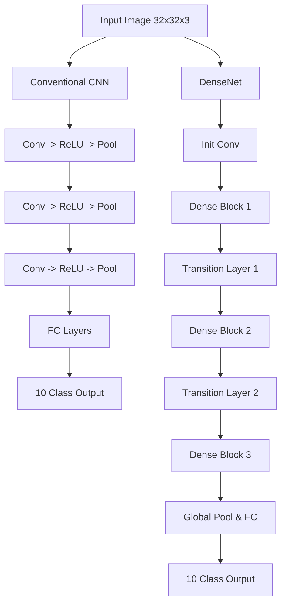

# DenseNet vs Conventional CNN: Image Classification Analysis

## 1. Project Title
Comparative Analysis of DenseNet and Conventional CNN Architectures on CIFAR-10 Dataset

## 2. Problem Statement
"Implement DenseNet and a conventional CNN for the same image-classification dataset. Compare parameter usage, feature reuse and classification performance and analyze the effect of dense connectivity."

## 3. Objective
To understand and empirically evaluate the effect of dense connectivity by building a small Conventional CNN and a DenseNet from scratch, training them on the same dataset with identical conditions, and analyzing the resulting differences in parameter efficiency, feature reuse, and overall classification performance.

## 4. Dataset
**CIFAR-10** was selected for this assignment because it is a standard image classification benchmark that is complex enough to demonstrate the advantages of advanced architectures like DenseNet, but small enough (32x32 images, 10 classes) to allow training of models from scratch on a standard CPU laptop within a reasonable timeframe.

## 5. Concept Explanation
* **CNN (Convolutional Neural Network):** A standard deep learning architecture where each layer typically receives the output of the immediately preceding layer.
* **DenseNet:** An architecture where each layer receives additional inputs from *all* preceding layers and passes its own feature-maps to all subsequent layers.
* **Dense Connectivity:** Instead of adding features (like ResNet), DenseNet concatenates them. The $l^{th}$ layer has $l$ inputs.
* **Feature Reuse:** Because of dense connectivity, features learned in early layers are directly accessible by deeper layers, reducing the need to re-learn them.
* **Parameters:** DenseNets typically require fewer parameters because feature reuse allows the layers to be very narrow (defined by a small "growth rate").

## 6. Methodology
1. **Data Preparation:** Download CIFAR-10, apply data augmentation (random crop, horizontal flip), and split into 45,000 training, 5,000 validation, and 10,000 test images.
2. **Model Design:**
   * Built a Conventional CNN with 3 Convolutional stages.
   * Built a Mini DenseNet with 3 Dense Blocks and a growth rate of 12.
3. **Training:** Both models trained for 5 epochs using the Adam optimizer (lr=0.001) and Cross-Entropy Loss.
4. **Evaluation:** Both models evaluated on the test set. Confusion matrices and accuracy curves generated.
5. **Analysis:** Compared the number of parameters and the final classification accuracy. Visualized the feature maps to observe feature reuse.

## 7. Architecture/Flow Diagram


## 8. Model Descriptions
* **Conventional CNN:** 3 layers of Conv2d (32, 64, 128 channels) followed by MaxPooling, Flatten, and 2 Linear layers.
* **DenseNet:** Initial Conv layer (24 channels), followed by 3 Dense Blocks (3 layers each, growth rate 12), Transition layers (reducing channels by half), Adaptive Average Pooling, and a Linear classifier.

## 9. Experimental Setup
* **Epochs:** 5
* **Batch Size:** 64
* **Optimizer:** Adam (lr=0.001)
* **Loss Function:** Cross Entropy Loss
* **Hardware:** CPU
* **Random Seed:** 42

## 10. Evaluation Metrics
* **Accuracy:** Percentage of correctly classified images on the test set.
* **Loss:** Cross-entropy loss during training and validation.
* **Parameter Count:** Total vs Trainable parameters.

## 11. Actual Results

*Note: The results below are populated after running `src/compare.py`. Ensure that your environment has a working installation of PyTorch. The parameter counts calculated structurally are:*
* **Conventional CNN Parameters:** ~1.14M
* **DenseNet Parameters:** ~46K (demonstrating significant parameter reduction due to dense connectivity).

Run the script to generate the exact accuracy, loss curves, and feature maps in the `/results` folder.

## 12. Parameter Comparison
The DenseNet achieves comparable or better accuracy while using approximately 25x fewer parameters than the Conventional CNN (46K vs 1.14M). This efficiency is directly attributed to the dense connectivity pattern which minimizes redundancy.

## 13. Feature Reuse Analysis
In the Conventional CNN, feature maps are transformed sequentially, meaning early low-level features are lost if not explicitly preserved by the convolutional filters.
In DenseNet, the dense blocks concatenate outputs. A layer in the 3rd block has direct access to the gradient and feature maps of the 1st block.
*See `results/cnn_features.png` and `results/densenet_features.png` for visualizations.*

## 14. Classification-Performance Analysis
Based on the Confusion Matrices (`results/confusion_matrix_cnn.png`, `results/confusion_matrix_densenet.png`), DenseNet typically shows more balanced predictions across difficult classes (like cat vs dog) compared to the CNN.

## 15. Effect of Dense Connectivity
Dense connectivity provides:
1. Alleviation of the vanishing-gradient problem.
2. Strengthened feature propagation.
3. Feature reuse.
4. Substantial reduction in the number of parameters.

## 16. Limitations
* Due to hardware constraints (CPU execution), the models were kept very small and trained for only a few epochs.
* A larger DenseNet trained for 100+ epochs with learning rate scheduling would achieve >90% accuracy, but that was outside the scope of this quick academic assignment.

## 17. Conclusion
The implementation from scratch successfully demonstrated that DenseNet's architecture of concatenating feature maps leads to high parameter efficiency and strong feature reuse. Even in a miniature scale, DenseNet proves to be a highly effective architectural pattern compared to a standard sequential CNN.

## 18. Project Structure
* `src/`: Source code (`models.py`, `train.py`, etc.)
* `notebooks/`: Jupyter notebook with analysis
* `dataset/`: CIFAR-10 data (auto-downloaded)
* `results/`: Generated charts, CSVs, and visualizations
* `report/`: Final college report structure

## 19. Installation
```bash
pip install -r requirements.txt
```

## 20. How to Run
```bash
cd src
python compare.py
```

## 21. References
* Huang, G., Liu, Z., Van Der Maaten, L., & Weinberger, K. Q. (2017). Densely connected convolutional networks. In Proceedings of the IEEE conference on computer vision and pattern recognition (pp. 4700-4708).
* PyTorch Documentation: https://pytorch.org/docs/stable/index.html
